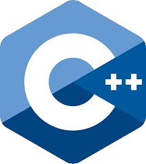

<h1 align="center">Tetris Project Using C++ Programming Language</h1>
<div align="center">
  
</div>

# Apa saja yang ada dalam game ?
<ol>
  <li>Fitur 1: Normal Mode</li>
  <li>Fitur 2: Boss Mode</li>
</ol>

# Algoritma Dasar 
  Yang pertama bentuk dulu pakai array atau vector 3D Dimensi 1 isinya untuk randoman bentuk tetromino yang akan keluar, Dimensi 2 dan Dimensi 3 nya berguna
untuk menggambar bentuk tetromino yang akan digambar dimana yang angka 1 akan digambar sedangkan yang angka 0 tidak akan dimunculkan dalam layar. Untuk jatuhnya
ketika tetromino nya menyentuh tanah saya menyalin isi tetromino yang isinya 1 ke dalam array arena atau map namun saya salin menjadi angka 7. Alasan pakai array
peta integer karena mudah saat mengatur atau dalam pengecekan input nya karena kalau string nulis petik dua (" ") sungguh menjengkelkan oleh karena itu kita memakai 
prosedur Draw untuk menggambar game kita

# FUNCTION canMove - buat ngecek kapan si tetromino berhenti jatuh 

```
bool canMove(int arena[height][width], int position_x, int position_y, vector<vector<int>> &currentTetromino) {
    int newHeight = currentTetromino.size();
    int newWidth = currentTetromino[0].size();
    for (int i = 0; i < newHeight; i++) {
        for (int j = 0; j < newWidth; j++) {
            if (currentTetromino[i][j] == 1) {
                int newY = position_y + i;
                int newX = position_x + j;
                if (newY >= height || newX < 0 || newX >= width || arena[newY][newX] == 7 || arena[newY][newX] == 2) {
                    return false; // Tidak bisa bergerak
                }
            }
        }
    }
    return true;
}

```

Cara kerja:
1. Yang pertama aku buat loop untuk mengambil tetromino yang isinya 1 dulu lalu kita ikuti pergerakan turun nya seperti normal nya
2. Kalau salah satu bagian tetromino yang berisi angka 1 sudah menyentuh tanah sehingga kalau sudah nyentuh tanah dia bakal berhentiin
   loop yang ada di main dan main sendiri akan menggambar nya di posisi sebelum menyentuh tanah nya

# FUNCTION canTurnLeft dan canTurnRight - untuk pengecekan gerak kanan atau kiri 

```
bool canTurnLeft(int arena[height][width], int position_x, int position_y, vector<vector<int>> &currentTetromino, int dx) {
    int newHeight = currentTetromino.size();
    int newWidth = currentTetromino[0].size();
    for (int i = 0; i < newHeight; i++) {
        for (int j = 0; j < newWidth; j++) {
            if (currentTetromino[i][j] == 1) {
                if (arena[position_y + i][position_x + j - 1] == 7) {
                    return false;
                }
            }
        }
    }
    return true;
}

bool canTurnRight(int arena[height][width], int position_x, int position_y, vector<vector<int>> &currentTetromino, int dx) {
    int newHeight = currentTetromino.size();
    int newWidth = currentTetromino[0].size();
    for (int i = 0; i < newHeight; i++) {
        for (int j = 0; j < newWidth; j++) {
            if (currentTetromino[i][j] == 1) {
                if (arena[position_y + i][position_x + j + 1] == 7) {
                    return false;
                }
            }
        }
    }
    return true;
}

```

Cara kerja:
1. Pertama kita loop bentuk tetromino
2. Untuk tetromino yang berisi 1 aku tambah dengan posisi Y nya dan jika di kiri atau kanan sudah ada
   balok tetromino lain maka function ini akan melarang kbhit() atau melarang player bergerak kanan atau kiri
-- Note: "Disini saya memisah function untuk pengecekan kiri atau kanan agar tidak ribet saja" --

# FUNCTION canRotate - untuk mencegah apakah tetromino dapat diputar

```
bool canRotate(int arena[height][width], int position_x, int position_y, vector<vector<int>> &rotatedTetromino) {
    int newHeight = rotatedTetromino.size();
    int newWidth = rotatedTetromino[0].size();
    for (int i = 0; i < newHeight; i++) {
        for (int j = 0; j < newWidth; j++) {
            if (rotatedTetromino[i][j] == 1) {
                int newY = position_y + i;
                int newX = position_x + j;
                if (newY >= height || newX < 0 || newX >= width || arena[newY][newX] == 7 || arena[newY][newX] == 2) {
                    return false; // Tidak bisa diputar
                }
            }
        }
    }
    return true;
}

```

Cara kerja:
1. Yang pertama kita putar dulu bentuk tetromino nya  
2. Yang kedua kita mengecek area sekitar tetromino setelah diputar apakah menyentuh tanah atau border atau
   tetromino yang sudah jatuh jika dapat diputar maka fungsi akan mengembalikan nilai true yang berarti dapat diputar
4. Yang terakhir setelah mendapat validasi baru tetromino yang lama di ubah menjadi tetromino yang sudah diputar

# PROCEDURE rotateMatrix - untuk memutar bentuk tetromino

```
// Fungsi untuk memutar tetromino ke kanan (90 derajat searah jarum jam)
vector<vector<int>> rotateMatrix(const vector<vector<int>> &matrix) {
    int n = matrix.size();
    int m = matrix[0].size();
    vector<vector<int>> rotated(m, vector<int>(n, 0));
    for (int i = 0; i < n; i++) {
        for (int j = 0; j < m; j++) {
            rotated[j][n - 1 - i] = matrix[i][j];
        }
    }
    return rotated;
}

```

Cara kerja: 
1. Yang pertama cek dulu ukuran tetromino baris x kolom
2. Selanjutnya, buat tetromino dengan ukuran kolom menjadi baris dan baris menjadi kolom (kolom x baris)
3. Lalu pindah index-index array sesuai dengan kondisi yang sudah diputar 

# PROCEDURE hardDrop - buat agar jika dipencet 's' tetromino nya langsung jatuh 

```
void hardDrop(int arena[height][width], vector<vector<int>> currentTetromino, int position_x, int position_y, bool drop, int &temp, int randomTetromino) {
    int shadowColor = tetrominoColors[randomTetromino];
    while (canMove(arena, position_x, position_y, currentTetromino)) {
        if (canMove(arena, position_x, position_y, currentTetromino)) {
            position_y++;
        }
    }

    for (int i = 0; i < currentTetromino.size(); i++) {
        for (int j = 0; j < currentTetromino[i].size(); j++) {
            if (currentTetromino[i][j] == 1) {
                if (arena[position_y + i - 1][position_x + j] != 1 && arena[position_y + i - 1][position_x + j] != 7 && arena[position_y + i - 1][position_x + j] != 2) {
                    arena[position_y + i - 1][position_x + j] = 4;
                    arenaColors[position_y + i - 1][position_x + j] = shadowColor; // Set color for shadow
                }
            }
            if (drop) {
                temp = position_y;
            }
        }
    }
}

```

Cara kerja: 
1. Memakai function canMove buat ngecek pada ketinggian berapa dia bakal menyentuh tanah
2. Kalau udah ketemu digambar bayangan nya dengan loop sesuai bentuk tetromino yag jatuh
3. Cara kerja jatuhnya yang diatas selama ada bentuk nya atau angka 1 bentuknya dihilangkan atau 1 nya diganti 0 lalu ada variable
   Pass By Refference untuk ngubah posisi y tetromino yang lagi jatuh agar langsung ke tanah

# PROCEDURE clearLines - untuk menghapus baris jika tetromino memenuhi 1 baris

```
void clearLines(int arena[height][width], int &bossHealth, int arenaColors[height][width], bool &bossDamaged) {
     for (int i = 1; i < height - 1; i++) {
         bool fullLine = true;
         for (int j = 1; j < width - 1; j++) {
             if (arena[i][j] != 7) {
                 fullLine = false;
                 break;
             }
         }
         if (fullLine) {
              if(doubleDamage == true) {
                  score += 200;
                  bossHealth -= 200;
                  doubleDamage = false;
              } else {
                  score += 100;
                  bossHealth -= 100;
              }
              mana++;
              bossDamaged = true;
             for (int j = 1; j < width - 1; j++) {
                 arena[i][j] = 0;
             }
             for (int k = i; k > 1; k--) {
                 for (int j = 1; j < width - 1; j++) {
                     arena[k][j] = arena[k - 1][j];
                     arenaColors[k][j] = arenaColors[k - 1][j];

                 }
             }
         }
     }
 }

void clearLines(int arena[height][width], int arenaColors[height][width]) {
    for (int i = 1; i < height - 1; i++) {
        bool fullLine = true;
        for (int j = 1; j < width - 1; j++) {
            if (arena[i][j] != 7) {
                fullLine = false;
                break;
            }
        }
        if (fullLine) {
            score += 100;
            for (int j = 1; j < width - 1; j++) {
                arena[i][j] = 0;
            }
            for (int k = i; k > 1; k--) {
                for (int j = 1; j < width - 1; j++) {
                    arena[k][j] = arena[k - 1][j];
                    arenaColors[k][j] = arenaColors[k - 1][j];
                }
            }
        }
    }
}

```

Cara kerja:
1. Pertama mengecek arena tetris per baris dan jika ada yang terputus baris nya akan lanjut ke baris berikut nya dan di cek lagi
2. Saya menggunakan overloading procedure untuk setiap mode karena dalam mode boss ada skill untuk menghancurkan baris paling bawah
